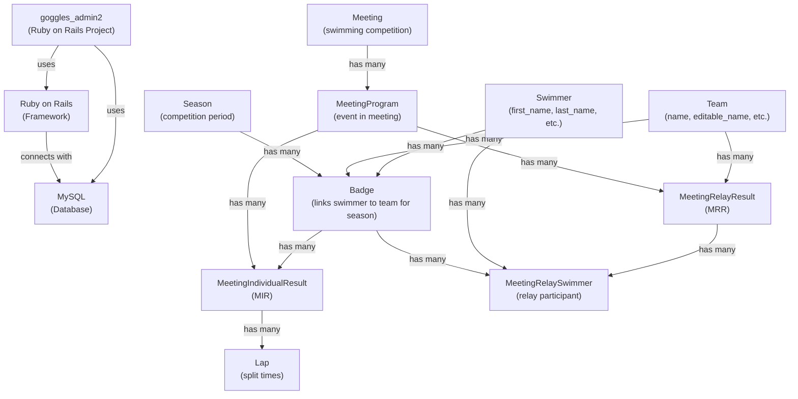
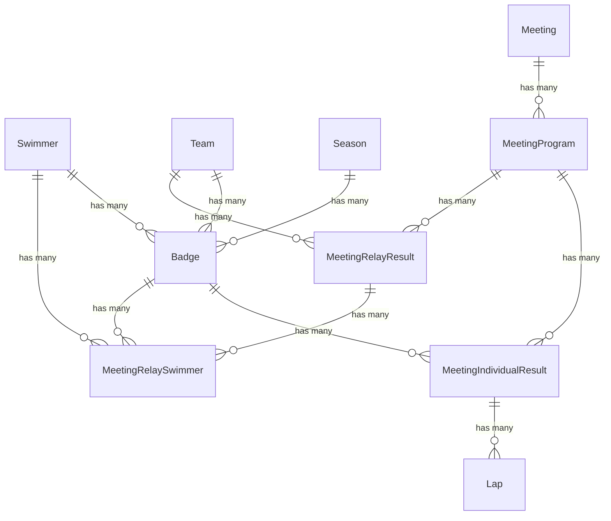

```mermaid
graph TD
    %% Project and Technology Stack
    goggles["goggles_admin2<br>(Ruby on Rails Project)"]
    rails["Ruby on Rails<br>(Framework)"]
    mysql["MySQL<br>(Database)"]

    %% Database Entities
    swimmer["Swimmer<br>(first_name, last_name, etc.)"]
    team["Team<br>(name, editable_name, etc.)"]
    badge["Badge<br>(links swimmer to team for season)"]
    season["Season<br>(competition period)"]
    meeting["Meeting<br>(swimming competition)"]
    program["MeetingProgram<br>(event in meeting)"]
    mir["MeetingIndividualResult<br>(MIR)"]
    lap["Lap<br>(split times)"]
    mrr["MeetingRelayResult<br>(MRR)"]
    mrs["MeetingRelaySwimmer<br>(relay participant)"]

    %% Stack relationships
    goggles -->|uses| rails
    goggles -->|uses| mysql
    rails -->|connects with| mysql

    %% Entity relationships
    swimmer -->|has many| badge
    team -->|has many| badge
    season -->|has many| badge
    
    badge -->|has many| mir
    program -->|has many| mir
    mir -->|has many| lap
    
    team -->|has many| mrr
    program -->|has many| mrr
    mrr -->|has many| mrs
    
    swimmer -->|has many| mrs
    badge -->|has many| mrs
    
    meeting -->|has many| program
```

```mermaid
erDiagram
    Swimmer ||--o{ Badge : "has many"
    Team ||--o{ Badge : "has many"
    Season ||--o{ Badge : "has many"
    
    Badge ||--o{ MeetingIndividualResult : "has many"
    MeetingProgram ||--o{ MeetingIndividualResult : "has many"
    MeetingIndividualResult ||--o{ Lap : "has many"
    
    Team ||--o{ MeetingRelayResult : "has many"
    MeetingProgram ||--o{ MeetingRelayResult : "has many"
    MeetingRelayResult ||--o{ MeetingRelaySwimmer : "has many"
    
    Swimmer ||--o{ MeetingRelaySwimmer : "has many"
    Badge ||--o{ MeetingRelaySwimmer : "has many"
    
    Meeting ||--o{ MeetingProgram : "has many"
```
